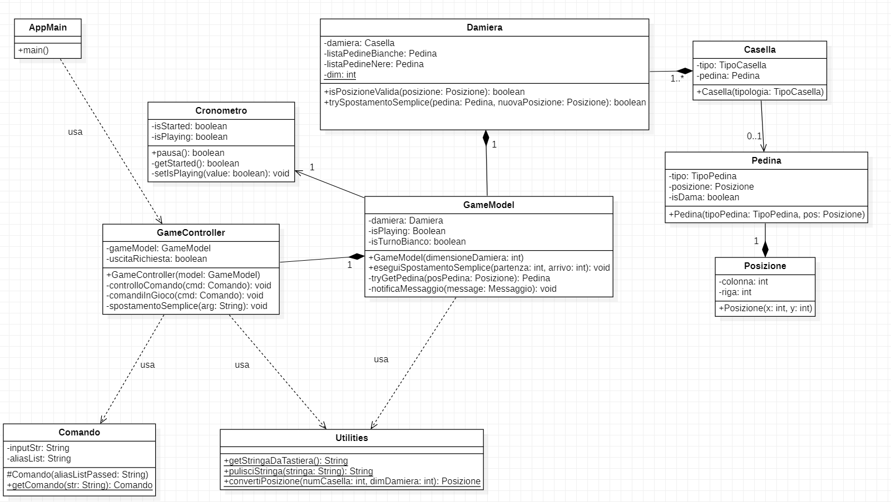
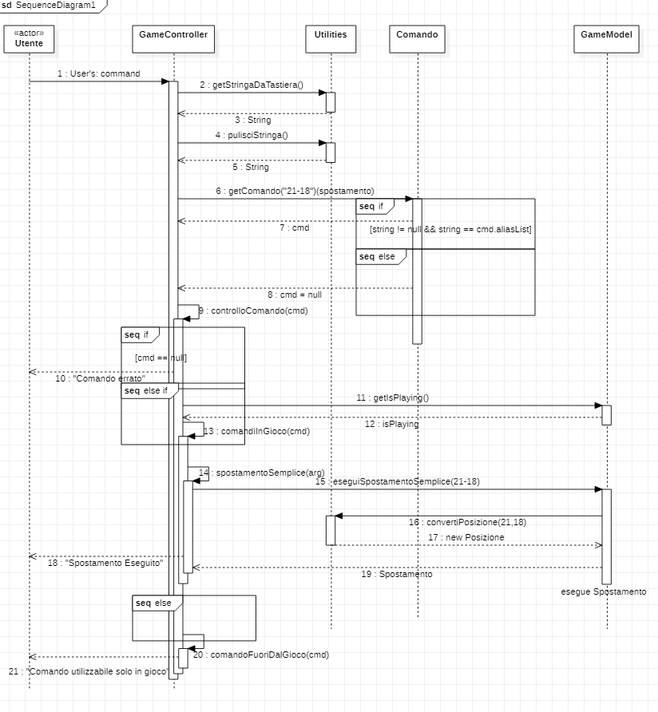
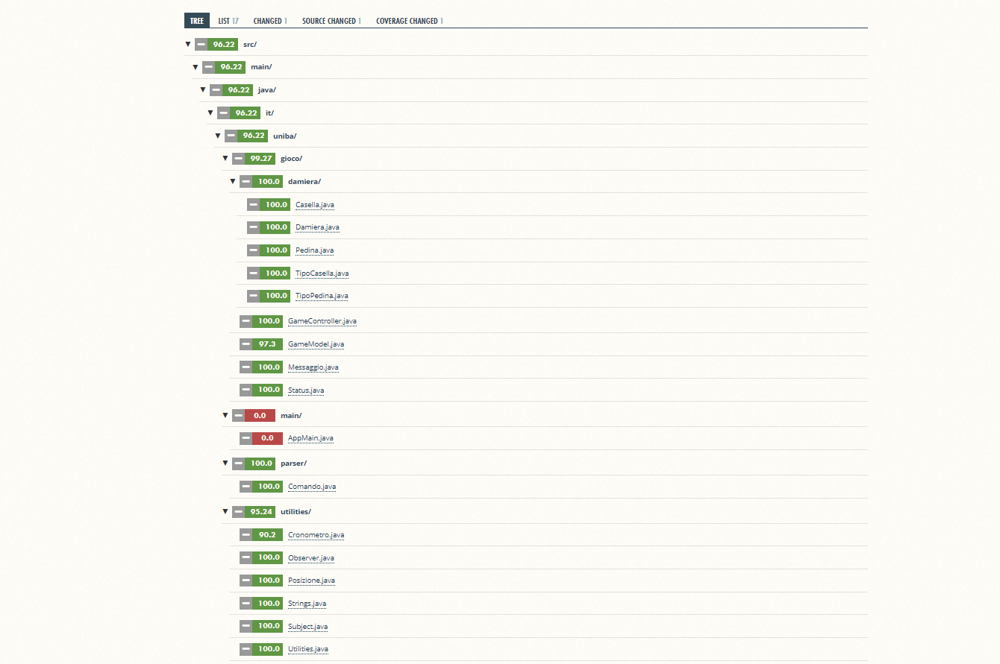

# Relazione tecnica finale

### Indice

<br/>

1. [Introduzione](#Introduzione)
2. [Modello di dominio](#Modello-di-dominio)
3. [Requisiti specifici](#Requisiti-specifici)
* [Requisiti funzionali](#Requisiti-funzionali)
* [Requisiti non funzionali](#Requisiti-non-funzionali)
4. [System Design](#System-Design)
* [Stile architetturale adottato](#Stile-architetturale-adottato)
* [Diagramma dei packages](#Diagramma-dei-packages)
* [Commento delle decisioni prese](#Commento-delle-decisioni-prese)
5. [O.O. Design](#OO-Design)
* [Diagramma delle classi e diagramma di sequenza](#Diagramma-delle-classi-e-diagramma-di-sequenza)
* [Design pattern utilizzati](#Design-pattern-utilizzati)
* [Commento delle decisioni prese](#Commento-delle-decisioni-prese-(2))
6. [Riepilogo test](#Riepilogo-test)
7. [Manuale utente](#Manuale-utente)
8. [Processo di sviluppo e organizzazione del lavoro](#Processo-di-sviluppo-e-organizzazione-del-lavoro)
9. [Analisi retrospettiva](#Analisi-retrospettiva)
* [Cosa ci ha resi soddisfatti](#Cosa-ci-ha-resi-soddisfatti)
* [Cosa ci ha resi insoddisfatti](#Cosa-ci-ha-resi-insoddisfatti)
* [Cosa ci ha fatto impazzire](#Cosa-ci-ha-fatto-impazzire)
10. [Conclusione](#Conclusione)

<br/><br/>

## **Introduzione**

Questo documento ha il compito di illustrare l’utilizzo della prima versione dell’applicazione della **Dama Italiana**.
Il programma consente a due giocatori di sfidarsi in una partita tramite interfaccia a **[linea di comando(CLI)](https://devindev.lidialab.it/cli-command-line-interface-o-command-line-interpreter/)**, indicando le proprie mosse in notazione algebrica.

L'applicativo software, oggetto del documento, è stato sviluppato dal gruppo **mills**, il cui nome si riferisce al grande ingegnere del software Harlan D. Mills. Il gruppo mills è composto da:

* **[Riccardo Ranieri](https://github.com/RickNewere)**
* **[Giorgio Grimaldi](https://github.com/GiorgioGrimaldi)**
* **[Giuliano Picilli](https://github.com/Giuly123)**
* **[Fabio Spaccavento](https://github.com/fabiospaccavento)**
* **[Daniele Saccà](https://github.com/danielesacca)**

L'applicazione della Dama Italiana è eseguita tramite **[Docker](https://hub.docker.com/)**.

[Torna all'inizio](#Indice)
<br/>

## **Modello di dominio**

<center></center>

[Torna all'inizio](#Indice)
<br/>

## **Requisiti specifici**

Di seguito l'elenco dei requisiti specifici (funzionali e non funzionali):

## **Requisiti funzionali**

<center></center>

L'applicazione, una volta avviata, risponde ai seguente requisiti:

* L'utente può visualizzare i comandi disponibili tramite il comando ```help```.
<center></center>

* L'utente può iniziare una nuova partita tramite il comando ```gioca```.
<center></center>

* L'utente può abbandonare una partita già cominciata tramite il comando ```abbandona```.
<center></center>

* L'utente può chiudere il programma, previa conferma, tramite il comando ```esci```.
<center></center>

* L'utente può vedere la damiera numerata tramite il comando ```numeri```.
<center></center>

* L'utente può vedere la damiera con le pedine tramite il comando ```damiera```.
<center></center>

* L'utente può vedere il tempo trascorso, dall'inizio della partita, per entrambi i giocatori tramite il comando ```tempo```.
<center></center>

* L'utente può visionare lo storico di pedine prese di entrambi i giocatori tramite il comando ```prese```.
<center></center>

* L'utente può visionare lo storico delle mosse eseguite di entrambi i giocatori tramite il comando ```mosse```.
<center></center>

<br/>

## **Requisiti non funzionali**

I NFR (Non Functional Requirement) descrivono le caratteristiche di qualità del prodotto software da sviluppare, i requisiti di sistema/ambiente, le tecnologie e gli standard di cui il software deve tenere conto.

**Portabilità**

Il deployment dell'applicazione è automatizzato grazie a **[Docker](https://hub.docker.com/)** basato su **[Alpine Linux](https://hub.docker.com/_/alpine)**. Tramite esso è possibile utilizzare l'applicazione sulle seguenti **shell**:

*  **Windows**: **[Windows Subsystem for Linux (WSL)](https://docs.microsoft.com/it-it/windows/wsl/about)**, **[Git Bash](https://gitforwindows.org/)**, **[Windows Terminal](https://docs.microsoft.com/it-it/windows/terminal/get-started)**;
* **MacOS** e **Linux**: qualunque terminale con supporto a UTF-8.

* Il progetto deve essere scaricato tramite
  **[Docker](https://hub.docker.com/)** con il comando da shell: <center>

  ```docker pull docker.pkg.github.com/softeng2021-inf-uniba/progetto2021ter-mills/dama-mills:latest``` </center>

* Il progetto deve essere eseguito tramite **[Docker](https://hub.docker.com/)** con il comando da shell: <center>

  ```docker run --rm -it docker.pkg.github.com/softeng2021-inf-uniba/progetto2021ter-mills/dama-mills:latest```</center>

**Usabilità**

Il software prevede che l'utente conosca le regole generali del gioco della dama. 
Il livello di protezione dagli errori dell'utente consiste nella rigorosa analisi dell'input con opportune notifiche di comandi o mosse errate.
Inoltre, l'applicazione gestisce tutte le eventuali eccezioni.

**Manutenibilità**

Il software è stato realizzato utilizzando le best practices del linguaggio **[O.O. Java](https://www.html.
it/pag/50730/principi-di-oop/)** ed è strutturato secondo 
il pattern architetturale
**[MVC](https://it.wikipedia.org/wiki/Model-view-controller)**.
Il software è progettato in modo da poter consentire, con semplicitá, l'implementazione di altri comandi in futuro.

[Torna all'inizio](#Indice)
<br/>

## **System Design**

L'applicazione è interamente sviluppata in **[Java](https://www.java.com/it/)**. Questo è un linguaggio orientato agli oggetti, che permette l'esecuzione dei suoi applicativi su tutti i sistemi per cui è stata sviluppata una java virtual machine. L'intero progetto è contenuto all'interno di una repository privato su **[GitHub](https://github.com/)**. Inoltre abbiamo utilizzato **[Gradle](https://gradle.org/)**, un sistema per l'automazione dello sviluppo.

Inoltre la **[toolchain](https://it.wikipedia.org/wiki/Toolchain#:~:text=Toolchain%2C%20nell'informatica%20e%20in,programma%20o%20sistema%20di%20programmi.)** del programma comprende:

- **[CheckStyle](https://www.google.com/search?q=checkstyle&oq=checkstyle&aqs=chrome..69i57j35i39j0j69i61l3j69i60l2.1653j0j4&sourceid=chrome&ie=UTF-8)**, per uno stile del codice lineare e uniforme;
- **[SpotBugs](https://spotbugs.github.io/)**, per vedere se il codice presentava bug nascosti;
- **[JUnit](https://junit.org/junit5/)**, per il test di unità automatizzato tramite asserzioni;
- **[Jacoco](https://www.eclemma.org/jacoco/)**, utilizzato per fornire un report della copertura del codice da parte dei casi di test;
- **[Coveralls](https://coveralls.io/)**, per tener d'occhio, tramite interfaccia web, i risultati di copertura del codice da parte dei casi di test.

Inoltre per verificare la corretta esecuzione del codice su ogni macchina, ad ogni **[merge](https://it.wikipedia.org/wiki/Merge)** fatto, viene creata un'immagine su **[Docker](https://www.docker.com/)** che è possibile scaricare e **[runnare](https://it.wikipedia.org/wiki/Esecuzione_(informatica))** sulla propria macchina, per testarne il funzionamento.

## **Stile architetturale adottato**

Il programma è stato progettato secondo il pattern architetturale **[MVC](https://it.wikipedia.org/wiki/Model-view-controller)** (Model - View - Controller).

Abbiamo adottato un modello semplificato di questo pattern in cui non vi è la **View** e la logica che sarebbe dovuta essere contenuta in essa è stata inserita direttamente nel **Controller**.

Questa scelta è stata fatta in quanto tale suddivisione sarebbe risultata superflua poichè si tratta di un applicativo CLI.


## **Diagramma dei packages**

Di seguito riportato il diagramma dei **[packages](https://it.wikipedia.org/wiki/Package_(Java))**, ovvero la divisione in pacchetti della nostra applicazione:

<center></center>

## **Commento delle decisioni prese**

Abbiamo deciso di usare il pattern architetturale **MVC** per disaccopiare la logica e i dati del gioco dalla logica d'interfacciamento con l'utente.

[Torna all'inizio](#Indice)
<br/>

## **OO Design**

Di seguito vengono riportate le scelte fatte per una programmazione orientata agli oggetti.

## **Diagramma delle classi e diagramma di sequenza**
I diagrammi qui illustrati sono stati fatti con **[StarUML](https://staruml.io/)**

- Di seguito il diagramma delle classi del comando ```gioca```:

<center></center>

- Di seguito il diagramma di sequenza del comando ```gioca```:

<center></center>

- Di seguito il diagramma delle classi dello spostamento semplice:

<center></center>

- Di seguito il diagramma di sequenza dello spostamento semplice:

<center></center>


## **Design pattern utilizzati**

Nel progetto è stato utilizzato il Pattern
**[Observer](https://it.wikipedia.org/wiki/Observer_pattern)**.

Il pattern Observer permette di definire una dipendenza uno a molti fra oggetti, in modo tale che se un oggetto cambia il suo stato interno, ciascuno degli oggetti dipendenti da esso viene notificato e aggiornato automaticamente.

Il pattern Observer trova applicazione nei casi in cui diversi oggetti (Observer) devono conoscere lo stato di un oggetto (Subject).
In poche parole  abbiamo un oggetto che viene “osservato” (il subject) e tanti oggetti che “osservano” i cambiamenti di quest’ultimo (gli observers).

## **Commento delle decisioni prese (2)**

Il pattern precedentemente citato è stato utilizzato per mantenere un alto livello di consistenza fra classi correlate, senza produrre situazioni di forte dipendenza e di accoppiamento elevato.

Abbiamo creato quindi:

* Un'interfaccia generica, chiamata ```Observer```;
* Un soggetto da osservare, creato tramite la classe ```Subject```;
* L'enumerativo ```Status```, che si occupa di gestire i cambiamenti di stato per quanto riguarda la partita;
* L'enumerativo ```Messaggio```, utilizzato come argomento per segnalare cambi di stato.

[Torna all'inizio](#Indice)
<br/>

## **Riepilogo test**

Ecco i risultati dei nostri test sull'applicazione:

* Tabella riassuntiva del coverage generata da **[JaCoCo](https://www.eclemma.org/jacoco/)**:

<center></center>

* Report di **[Coveralls](https://coveralls.io/)**, percentuale totale dei casi testati:

<center></center>

* Report di **[Coveralls](https://coveralls.io/)**, albero delle classi

<center></center>

<br/>

Inoltre, gli elementi che abbiamo scelto di non testare sono:

* ```AppMain```;
* ```Strings```, poichè è una classe contentente solo le stringhe utilizzate nel programma (tutte costanti);
* Alcune eccezioni presenti, come nella classe ```GameModel``` e ```Cronometro```.

[Torna all'inizio](#Indice)
<br/>

## **Manuale utente**

L'applicazione 'Dama Italiana' mira a ricreare l'esperienza dell'omonimo gioco da tavolo, simulando su terminale la 
damiera e i sui pezzi.

Una volta **[scaricata]  l'applicazione(#Requisiti-non-funzionali)**, è possibile eseguirla tramite il comando:<center>

```docker run --rm -it docker.pkg.github.com/softeng2021-inf-uniba/progetto2021ter-mills/dama-mills:latest```
 </center>

 <br/>

Quando il programma sarà avviato verrà visualizzato il messaggio:<center>

```"⛃ Benvenuto  nella Dama  Italiana ⛃" ```

```"Digitare un comando o scrivere 'help' per visualizzare la lista dei comandi disponibili"```</center>

<br/>

Se avviato correttammente da questo momento in poi si potranno utilizzare i seguenti comandi:

* ```help``` - comando che viene suggerito dal banner iniziale, e che se invocato mostra la lista dei comandi disponibili. Inoltre descrive la notazione algebrica utilizzata per eseguire le mosse.

<br/>

* ```gioca``` - comando utilizzato per iniziare una nuova partita. Se invocato a partita non incorso si predisporrà a ricevere mosse esibendo il messaggio:<center>

  ```"É il turno del giocatore bianco"```

  Se viene richiamato durante una partita in corso apparirà il seguente messaggio di errore:<center>

  ```"Questo comando può essere utilizzato solamente fuori dalla partita"```</center>

<br/>    

* ```abbandona``` - comando utilizzato per abbandonare una partita in corso. Se invocato durante una partita, il programma richiede una conferma [si/no] e in caso affermativo termina la partita dando la vittoria a tavolino al giocatore avversario. In caso negativo si ripredispone a ricevere comandi previo seguente messaggio: <center>

  ```"La partita continua..."```</center>

  Se invocato al di fuori di una partita apparirà un messaggio di errore e successivamente il suggerimento di iniziare una nuova partita. I messaggi sono i seguenti:<center>

  ```"Questo comando può essere utilizzato solamente durante la partita"```

  ```"Inserire comando 'gioca' per iniziare una nuova partita"```</center>

  Qualora non si inserisca nè 'si/Si/sI/SI', nè 'no/No/nO/NO' l'applicazione rimane in attesa di una risposta consona previo messaggio di errore:<center>

  ```"Risposta non permessa! Riprova con 'si' o 'no'"```</center>

<br/>

* ```esci``` - comando utilizzato per uscire dall'applicazione. Se invocato mentre non si è in partita, il programma richiede una conferma [si/no] e in caso affermativo l'applicazione si chiude restituendo uno zero exit code. In caso negativo si ripredispone a ricevere comandi previo seguente messaggio:<center>

  ```"Uscita non eseguita..."```</center>

  Se invocato durante una partita apparirà un messaggio di errore che recita:<center>

  ```"Questo comando può essere utilizzato solamente fuori dalla partita"```</center>

  Qualora non si inserisca nè 'si/Si/sI/SI', nè 'no/No/nO/NO' l'applicazione rimane in attesa di una risposta consona previo messaggio di errore:<center>

  ```"Risposta non permessa! Riprova con 'si' o 'no'"```</center>

<br/>

* ```numeri``` - comando utilizzato per mostrare la damiera numerata. Il comando può essere invocato sia durante una partita che non poichè mostra solamente i numeri (da 1 a 32), disposti sulla damiera.

    <center></center>

<br/>

* ```damiera``` - comando utilizzato per mostrare la damiera con le pedine. Se utilizzato durante una partita mostra il posizionamento delle pedine in quel momento.

    <center></center>

  Se invocato al di fuori di una partita apparirà un messaggio di errore e successivamente il suggerimento di iniziare una nuova partita. I messaggi sono i seguenti:<center>

  ```"Questo comando può essere utilizzato solamente durante la partita"```

  ```"Inserire comando 'gioca' per iniziare una nuova partita"```</center>

<br/>

* ```tempo``` - comando utilizzato per mostrare il tempo trascorso per entrambi i giocatori. Comincerà a decorrere per il primo giocatore, nel nostro caso sempre il bianco, non appena verrà invocato il comando '*gioca*'. Non appena il bianco effettuerà una mossa ritenuta valida, finirà il suo turno ed inizierà quello del giocatore nero e anche il tempo del secondo giocatore comincerà a decorrere. Qualora si abbandoni una partita e si cominci una nuova, i due cronometri saranno azzerati e ripartiranno all'inizio del turno del primo giocatore. Se invocato al di fuori di una partita apparirà un messaggio di errore e successivamente il suggerimento di iniziare una nuova partita. I messaggi sono i seguenti:<center>

  ```"Questo comando può essere utilizzato solamente durante la partita"```

  ```"Inserire comando 'gioca' per iniziare una nuova partita"```</center>

<br/>

* ```prese``` - comando utilizzato per mostrare lo storico delle prese di entrambi i giocatori. Se invocato durante una partita mostra le pedine mangiate sia del bianco che del nero fino a quel momento. Se invocato al di fuori di una partita apparirà un messaggio di errore e successivamente il suggerimento di iniziare una nuova partita. I messaggi sono i seguenti:<center>

  ```"Questo comando può essere utilizzato solamente durante la partita"```

  ```"Inserire comando 'gioca' per iniziare una nuova partita"```</center>

<br/>

* ```mosse``` - comando utilizzato per mostrare lo storico delle mosse di entrambi i giocatori. Se invocato durante una partita mostra tutte le mosse fatte dai due giocatori in ordine cronologico. Se invocato al di fuori di una partita apparirà un messaggio di errore e successivamente il suggerimento di iniziare una nuova partita. I messaggi sono i seguenti:<center>

  ```"Questo comando può essere utilizzato solamente durante la partita"```

  ```"Inserire comando 'gioca' per iniziare una nuova partita"```</center>

  Se nessuna mossa è stata effettuata stamperà:<center>

  ```"Nessuna mossa effettuata"```</center>

<br/>

Una volta iniziata la partita tramite il comando '*gioca*' il programma si mette in attesa di una mossa del primo giocatore, nel nostro caso sempre il bianco. Se la mossa è corretta, viene eseguita e il turno viene aggiornato automaticamente. La mossa deve seguire la notazione algebrica:

<center></center>

<br/>

Per gli spostamenti semplici si deve seguire "l'Art 4 - Gli spostamenti semplici" del **[regolamento](http://www.fid.it/regolamenti/capo1.htm)**. Per le prese, sia singole che multiple, si devono seguire "l'Art 5-6 - Le prese - Le regole di presa" dello stesso regolamento.

Inoltre:

* Per ogni spostamento eseguito correttamente secondo notazione prestabilita si visualizzerà: <center>

  ```Mossa eseguita```

  ```É il turno del giocatore [colore_avversario]```</center>

* Per ogni presa di una pedina eseguita correttamente secondo notazione prestabilita (indipendentemente se si tratti di presa multipla o semplice), si visualizzerà, oltre a quello già riportato sopra: <center>

  ```Presa effettuata```</center>

* In caso di damatura eseguita correttamente secondo notazione prestabilita (indipendentemente se sia stata raggiunta con una presa o con uno spostamento semplice), si visualizzerà, oltre quello già riportato in precedenza: <center>

  ```Damatura effettuata```</center>

    <br/>

In caso di mosse errate i messaggi visualizzati, a seconda dei casi, saranno i seguenti:

* Casella di arrivo già occupata: <center>

  ```"Errore, non puoi fare questo spostamento"```</center>

* Casella di arrivo inesistente: <center>

  ```"Errore: Hai inserito una posizione al di fuori della damiera"```</center>

* Provare a muovere un pedina avversaria nel proprio turno: <center>

  ```"Errore: Hai selezionato una pedina avversaria"```</center>

* Presa singola/multipla errata:<center>

  ```"Errore: non puoi effettuare questa presa"```</center>

* Provare a muovere una pedina da una posizione di partenza vuota:<center>

  ```"Hai selezionato una casella vuota"```</center>

[Torna all'inizio](#Indice)
<br/>

## **Processo di sviluppo e organizzazione del lavoro**

## Processo di sviluppo

Il programma è stato realizzato applicando la metodologia di **[Sviluppo Agile](https://it.wikipedia.org/wiki/Metodologia_agile)**. Quest'ultima è caratterizzata da **[Scrum](https://it.wikipedia.org/wiki/Scrum_(informatica))**, un framework di processo che prevede di dividere il progetto in blocchi rapidi di lavoro denominati **[Sprint](https://it.wikipedia.org/wiki/Scrum_(informatica)#Sprint)**, ognuno dei quali prevede un certo numero di funzionalità **([User Story](https://en.wikipedia.org/wiki/User_story))** richieste dal Product Owner. Tutte le user story sono contenute nella Product RoadMap del gruppo **mills** su **[GitHub](https://github.com/)**.

## **Suddivisione dei progetto**

Il progetto è stato diviso in quattro sprint. Dopo aver creato una **project board generale** che conteneva le user story e le sprint board, per ogni sprint:

* Veniva creato il **Milestone** corrispondente con gli obiettivi dello sprint

* Veniva creata una **project board** per lo sprint, che veniva suddivisa in cinque colonne ognuna delle quali indicava lo stato delle issue in quel momento. Gli stati sono:

  * **To Do**: nella quale si finivano le issue appena create;
  * **In Progress**: nella quale si trovavano le issue in elaborazione.
  * **Review**: nella quale si trovavano le issue pronte per essere revisionate;
  * **Ready**: nella quale si trovavano le issue chiuse e pronte per la revisione da parte dei docenti;
  * **Done**: nella quale si trovavano le issue chiuse e approovate dai docenti.

* Venivano aggiunte le user story dello sprint nello stato '*To Do*'.

* Ogni user story veniva assegnata:

  * a un partecipante in caso di user story poco complesse;

  * a più partecipanti in caso di user story più complesse così da fare pair programming.

* Ad ogni user story veniva assegnata una o più label, veniva messa in uno o più Project e assegnata ad un Milestone.

<br/>

## **Suddivisione dei compiti**

Ad ogni **[scrum meeting](https://www.agileway.it/il-daily-scrum-meeting/#:~:text=In%20quest'ultimo%20caso%2C%20lo,grafico%20prima%20di%20ogni%20meeting.)**, con cadenza settimanale, si è cercato di assegnare lo stesso numero di compiti da svolgere ad ogni singolo partecipante in modo da coinvolgere tutti ed essere quanto più equi possibile.

Per issue semplici, si è preferito assegnarle a singoli. Issue più o meno complesse venivano assegnate a coppie così da fare un lavoro di **[pair programming](https://it.wikipedia.org/wiki/Pair_programming)**. Le coppie variavano sempre in modo che tutti potessero lavorare con tutti, accrescendo così l'intesa del Team.

Il lavoro di revisione, tramite **[pull request](https://marcolombardo.com/blog/open/source/2019/03/13/iniziare-con-git-e-github-la-pull-request.html)**, veniva anch'esso diviso. Per issue semplici, si preferiva assegnare la revisione ad un solo membro, per issue più complessi anche a più di un membro.

<br/>

## **Piattaforme di comunicazione**

Per la comunicazione, il nostro gruppo, ha adottato due piattaforme:

* **[Discord](https://discord.com/brand-new)**
* **[Whatsapp](https://www.whatsapp.com/?lang=it)**

La prima è stata scelta poichè una piattaforma a tutti i membri del gruppo familiare, la quale permetteva di fare videoconferenze e di condividere lo schermo. Ciò è stato molto utile nel momento in cui uno o più membri hanno avuto difficoltà con particolari issue, che con l'aiuto di tutti, sono stati risolti in poco tempo.

<center></center>

La seconda è stata scelta poichè, essendo anche questa familiare, era il mezzo di comunicazione più veloce in ogni momento. Tramite essa ci si confrontava durante le lezioni, si decidevano i giorni e gli orari per gli **scrum meeting** / **meeting di retrospettiva** e ci si teneva in contatto.

<center></center>

[Torna all'inizio](#Indice)
<br/>

## **Analisi retrospettiva**

A posteriori questi sono i risultati dell'analisi retrospettiva:

## **Cosa ci ha resi soddisfatti**

Il denominatore comune tra tutti i membri del gruppo è la consapevolezza di aver acquisito una buona capacità di lavorare in team. Questa simulazione di un'esperienza lavorativa è servita ad ognuno di noi per:

* Imparare il linguaggio java e il paradigma ad oggetti;

* Affinare ed acquisire *skills* di programmazione;

* Comprendere l'utilizzo di strumenti di version control come *Git e GitHub*;

* Comprendere l'utilizzo di strumenti di deployement automatizzato con *Docker*;

È stato molto interessante mettersi alla prova nei limiti di tempo dei vari sprint, per sentirsi poi soddisfatti quando al termine funzionava tutto.

Durante gli sprint, grazie a discrete conoscenze pregresse del linguaggio utilizzato, non abbiamo avuto grossi problemi nel portare a termine i vari issue, eccezion fatta per la fase di testing che abbiamo risolto grazie al lavoro di squadra.

## **Cosa ci ha resi insoddisfatti**

La cosa che ha demoralizzato maggiormente è stata l'impossibilità di potersi incontrare giornalmente in università data la situazione **pandemica**. Infatti, almeno all'inizio, c'era quel velo di vergogna tra persone che non si erano mai viste. Ciò è sparito con il passare del tempo e le numerose call fatte. In particolare il rapporto si è consolidato nel mese di Maggio quando ci siamo incontrati per le prime volte in università.

## **Cosa ci ha fatto impazzire**

Come già scritto, la situazione pandemica ha costretto tutti noi a svolgere questo progetto a distanza.

A nome di tutto il gruppo ciò che ci ha fatto impazzire è stato il microfono di **[Fabio Spaccavento](https://github.com/fabiospaccavento)** che ad ogni call non funzionava e noi ci divertivamo a prendere in giro.

[Torna all'inizio](#Indice)
<br/>

## **Conclusione**

Scherzi a parte, riteniamo che questo progetto sia stato un importante banco di prova. Nonostante le difficoltà siamo riusciti comunque a centrare gli obiettivi stabiliti e a trarre il meglio da questa esperienza formativa.

**Cosa più importante è stata l'amicizia nata tra membri del gruppo!**

<center>

Grazie per l'attenzione.
Lo staff, **[mills](https://github.com/softeng2021-inf-uniba/progetto2021ter-mills)**.

</center>